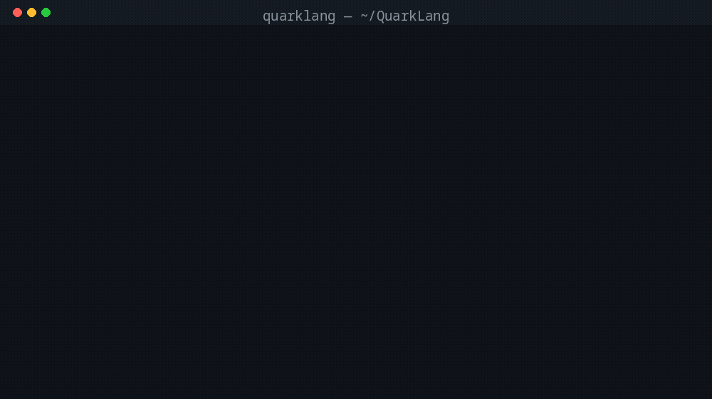

# QuarkLang（qkc）

[](https://github.com/QuarkLangCommunity/QuarkLangQkc/actions/workflows/ci.yml)
[](https://github.com/QuarkLangCommunity/QuarkLangQkc/actions/workflows/release.yml)
[](https://github.com/QuarkLangCommunity/QuarkLangQkc/releases/latest)


**QuarkLang 是一门「类型在前」的编译型语言：同一份源码，两个后端** —— Go 解释器（改完即跑）与 LLVM 编译器 `qkc`（性能 = C）。
面向**高计算、高并发、海量临时数据**的 CLI 与服务：`fib(35)` 21 ms（C 22 ms）、用户态任务并发、block 线性分配无 GC 停顿；
自带静态检查 / 文档生成 / REPL / 语言服务器与 VS Code、tree-sitter 支持，**零第三方 Go 依赖**。

| 你是谁 | 你会得到什么 |
|---|---|
| 想找「编译后真快」的语言 | 编译路径性能 = C（同 LLVM 后端），P99 延迟逐分位同级 |
| 写 CLI / 计算脚本 / 常驻服务 | 解释器秒级迭代；`qkc -run file.qk` 一键编译执行 |
| 需要并发又怕 GC 停顿 | `taskm` 用户态任务 + 线程池；block 分配，无 GC 停顿 |
| 中文项目 / 教学中使用 | 语法极简（`fn` `type` `impl` `space`），工具链与报错中文优先 |
| 做编辑器 / 工具集成 | 稳定 CLI + LSP + tree-sitter 语法，`-json` 机器可读诊断 |

<p align="center"></p>

> GIF 内容全部来自真实运行（生成脚本 `scripts/make-demo-gif.py`，可复现）：
> `quark hello.qk` → `qkc -run hello.qk` → `qkcheck examples/`（真实告警，非编造）。

## 🚀 快速开始

```sh
# ① 预编译二进制（Linux x86_64；macOS / Windows 见 Releases，均有对应产物）
curl -fsSL https://github.com/QuarkLangCommunity/QuarkLangQkc/releases/latest/download/quark-linux-amd64 -o quark \
  && chmod +x quark && ./quark examples/hello.qk
```

```sh
# ② 从源码（一行；需要 Go ≥ 1.26）
git clone --depth 1 https://github.com/QuarkLangCommunity/QuarkLangQkc && cd QuarkLangQkc \
  && go build -o quark . && ./quark examples/tour.qk
```

```sh
# ③ 编译执行（LLVM 原生；需要 clang）
cd compiler && go build -o qkc . && ./qkc -run ../examples/hello.qk
```

```sh
# ④ 工具链（共用同一前端）：静态检查 / 文档 / REPL / 语言服务器
go build -o qkcheck ./cmd/qkcheck && ./qkcheck examples/          # 有诊断退出 1
go build -o qkdoc   ./cmd/qkdoc   && ./qkdoc -o API.md examples/tour.qk
go build -o qkrepl  ./cmd/qkrepl  && ./qkrepl -e "int x = 6;" -e "x * 7"
go build -o qklsp   ./cmd/qklsp   && ./qklsp                      # 编辑器接入见 editors/
```

> Release 同时上传**带版本号**与**不带版本号**两种产物名（如 `quark-linux-amd64`），
> 后者可写进脚本固定 URL；校验用同目录 `MANIFEST-<版本>-<平台>.txt`（sha256）。

<details>
<summary>从源码构建的完整说明（解释器 / 编译器依赖）</summary>

```sh
go build -o quark .
./quark examples/hello.qk
go test ./internal/lang/     # 全量测试（-race 可跑）
```

```sh
cd compiler && go build -o qkc .
./qkc -run hello.qk          # LLVM IR → clang 原生 → 执行
./qkc hello.qk               # 仅输出 IR
```

**依赖**：Go ≥ 1.26（零第三方 Go 依赖）；LLVM 工具链（`clang`/`lli`/`llvm-as`，系统包）。可选 `rustc`/`gcc` 仅用于跨语言对比基准。

</details>

## 目录

[快速开始](#-快速开始) · [语言速览](#语言速览) · [工具链](#工具链) · [亮点](#亮点) ·
[性能](#性能实测可复现) · [跨系统](#跨系统linux--macos--windows) · [语言特性](#语言特性v2-语法面) ·
[官方生态](#官方生态) · [项目结构](#项目结构) · [贡献](#贡献) · [设计文档](https://github.com/QuarkLangCommunity/QuarkLangQkc/blob/docs/spec.md)

## 语言速览

最真实的介绍是能跑起来的代码。下面这份 `examples/tour.qk` **在解释器与编译器两条路径上输出逐字节一致**：

```qk
program main;

type struct { int x; int y; } Point;          // 结构体：类型在前

impl {
    fn new(int x, int y) Point {               // 静态方法：无 self
        Point p = .{x: x, y: y};              // 结构体字面量
        return p;
    }
    fn sum(Point self) int {                   // 实例方法：首参 self
        return self.x + self.y;
    }
} Point;                                        // 实现：名字写在块后

fn<T> twice(T v) T { return v; }              // 泛型（类型擦除）

fn main(IOStream io) {
    Point p = Point::new(3, 4);                 // 静态调用 ::
    io.println("point sum =", p.sum());         // 实例调用 .

    List<int> l = [1, 2, 3];
    int total = 0;
    for (int v : l) { total = total + v; }
    io.println("list total =", total);

    try {
        io.println(1 / 0);
    } catch (void e) {                          // 错误可捕获
        io.println("caught: division by zero");
    }
    io.println("twice =", twice(21));
}
```

```sh
$ quark examples/tour.qk        # 或：qkc -run examples/tour.qk
point sum = 7
list total = 6
caught: division by zero
twice = 21
```

<details>
<summary>更多可运行示例（hello / fib / struct / macro / sum）</summary>

```sh
quark examples/hello.qk
quark examples/fib.qk
quark examples/struct.qk
quark examples/macro.qk
quark examples/sum.qk
```

</details>

## 工具链

| 工具 | 作用 | 一行上手 |
|---|---|---|
| `quark` | 解释器：改完即跑、REPL 友好 | `./quark examples/hello.qk` |
| `qkc` | LLVM 编译器 / 库制品 / 预处理器 | `./qkc -run hello.qk`（IR：`./qkc hello.qk`） |
| `qkcheck` | 静态检查 QK101–QK115，`-json` 供 CI/编辑器 | `./qkcheck examples/` |
| `qkdoc` | `/* */`+`pub` → Markdown / HTML API 文档 | `./qkdoc -o API.md lib.qk` |
| `qkrepl` | 交互式求值：多行块、持久环境 | `./qkrepl -e "int x = 6;" -e "x * 7"` |
| `qklsp` | 语言服务器：诊断/跳转/补全/悬停/大纲 | `./qklsp`（VS Code 扩展见 `editors/vscode`） |

```sh
go build -o qkcheck ./cmd/qkcheck
./qkcheck examples/                                  # 目录或文件；有诊断退出 1
./qkcheck -json -L ../QuarkLangLibs-Style lib.qk     # CI/编辑器消费；-L 追加 import 搜索目录
./qkcheck -params src.qk                             # 附带检查未使用形参
```

| 码 | 检查 | 说明 |
|---|---|---|
| QK101 | 未使用变量 | 声明后从未读取（含「只被赋值」）；`_` 前缀忽略 |
| QK102 | 未使用形参 | 需 `-params`（接口实现常有忽略形参） |
| QK103 | 不可达代码 | `return`/`log`/`break` 之后的语句；两分支皆返回之后的语句 |
| QK104 | 遮蔽 | `for`（两种）/`catch` 变量遮蔽外层同名变量（编译器未拦截的三处） |
| QK105 | 缺返回 | 声明非 void 返回类型却存在不返回值即结束的路径（解释器得 nil，`qkc` 补零值——两端不一致） |
| QK106 | 接口未实现 | 近失配：实现了接口的部分方法、缺其余（列出缺失方法名） |
| QK107 | void 值误用 | void 函数调用结果被当作值使用（运行期为 nil） |
| QK108 | 自赋值 | `x = x` / `p.x = p.x` / `l[i] = l[i]`（结构等价形式，无效果） |
| QK109 | 常量条件 | `if (true/false)`、`while (false)`；`while (true)` 且体内无 `break`/`return`（可能死循环） |
| QK110 | 常量除零 | 字面量 `/ 0`、`% 0`；**try 块内豁免**（那里是刻意的错误处理） |
| QK111 | 未使用导入 | `import` 了某库却未使用其任何符号；库不可解析时跳过 |
| QK112 | 遮蔽全局函数 | 局部变量/形参遮蔽**全局函数**名（同名调用会被解析为该局部变量）；类型/空间名不受影响故不报 |
| QK113 | 死存储 | 赋值（含声明初值）被后续赋值覆盖且其间未读取；**引用写穿与循环体内赋值豁免** |
| QK114 | 自身比较 | `x == x`（恒真）/ `x != x`（恒假） |
| QK115 | 未被调用的函数 | 仅 `program main`（有 `main` 且无 `pub`）：整文件从未出现的函数即死代码；库文件不报 |

**误报率 / 漏报率（静态基准 + 随机化统计取 P99）**

```sh
# ① 人工标注基准（29 用例：15 缺陷 + 14 干净，含刻意不报的反例）
go test ./internal/lang/ -run TestLintBenchmark -v

# ② 随机化统计：每轮 4 个真值已知用例，多轮取 P50/P90/P99/max（默认 2000 轮）
go test ./internal/lang/ -run TestLintStatsP99 -v
LINT_ROUNDS=20000 LINT_SEED=7 go test ./internal/lang/ -run TestLintStatsP99 -v   # 深挖尾部

# ③ 真实语料扰动不变性（CRLF / 行尾注释 / 头部插行 / 行尾空白）
go test ./internal/lang/ -run 'TestLintCorpusPerturbation|TestLintCRLF' -v
```

单轮基准是确定性的（跑一万次结果一样），**P99 必须靠输入随机化才有分布**：统计测试每轮用不同种子
生成「干净骨架 + 注入 15 种缺陷之一」的用例，真值 = (诊断码, 行号)，位置也算考核项。

| 指标（每轮） | seed=1 | seed=7 | seed=20260918 |
|---|---|---|---|
| 误报 FP：P50 / P90 / P99 / max | 0 / 0 / 0 / 0 | 0 / 0 / 0 / 0 | 0 / 0 / 0 / 0 |
| 漏报 FN：P50 / P90 / P99 / max | 0 / 0 / 0 / 0 | 0 / 0 / 0 / 0 | 0 / 0 / 0 / 0 |
| 误报率 P99 / 漏报率 P99 | 0.0% / 0.0% | 0.0% / 0.0% | 0.0% / 0.0% |

合计 **3 种子 × 2000 轮 × 4 用例 = 24,000 个随机用例（12,000 次缺陷注入）**，P99 与最差值全为 0。
这套度量本身就是探测器：本轮抓出了 **QK115 判定过宽**（`program main;` 文件里带 `pub` 时被整文件跳过
→ 漏报），以及基准自身的两处缺陷（装饰用辅助函数在 main 程序里本就是死代码、插入行数手算错位）——
都被「真值必须精确匹配」逼出来并修掉。

| 指标 | 加强前 | 加强后 |
|---|---|---|
| 用例数（缺陷 15 + 干净 14） | 21 | 29 |
| TP / FP / FN | 6 / 1 / 14 | **20 / 0 / 0** |
| 误报率 FP/(TP+FP) | 14.3% | **0.0%** |
| 漏报率 FN/(TP+FN) | 70.0% | **0.0%** |

- 缺陷用例覆盖 QK101–QK115；干净用例含 **14 个「刻意不报」反例**（try 内除零、`while(true)`+break、
  重载里的 void 返回、完整接口实现、仅用 space/类型/宏的导入、类型名与空间名遮蔽、引用写穿、
  循环体内赋值、库文件里的未调用函数……）——这些都是加强过程中**真实出现过**的误报源，现已固化为回归用例
  （逐条做过对照实验：回退任一修复，基准立刻出现对应的 1 条误报）。
- **真实语料复核**：主仓 60 个 `.qk/.kq` → 0 错误、12 条警告（逐条复核为真，见
  `cmd/qkcheck` 语料快照测试的逐条注释）；4 个官方库仓约 4000 行 → 1 条真问题（局部变量从不读取）、
  **0 误报**。

<details>
<summary>qkdoc：API 文档生成</summary>

```sh
go build -o qkdoc ./cmd/qkdoc
./qkdoc lib.qk                       # Markdown 到 stdout
./qkdoc -all -o API.md style.qk      # 含未 pub 符号，写入文件
./qkdoc -html -o API.html style.qk   # 自包含 HTML（零外部资源）
```

- 文档注释：声明**上方紧邻**的 `//` 或 `/* */` 注释块（godoc 规则）；无上方注释时取**同行行尾**注释
  （`int x; // 横坐标`）；文件头注释作为文件说明。
- 默认只导出 `pub` 符号；文件没有 `pub`（如 `program main`）时导出全部；`impl`/`space`/`library`/`#macro`
  不受 `pub` 过滤（语言中 `pub` 不能前缀它们，而它们正是库对外 API 的载体；宏定义在解析前被切出 AST，由
  `ParseSourceAll` 显式提供）。
- 实测：`style.qk`（1567 行）→ 8ms 生成 335 行 Markdown（概览表 + 函数/类型/实现/空间分节）。

</details>

<details>
<summary>qkrepl：交互式求值</summary>

```sh
go build -o qkrepl ./cmd/qkrepl
./qkrepl                      # 交互：qk> 提示符，块未闭合自动续行 ..>
./qkrepl -e "int x = 6;" -e "x * 7"   # 一次性求值（多段共享环境）
printf 'fib(20)\n' | ./qkrepl # 批处理（stdin 非终端）
```

```
qk> fn fib(int n) int {      # 多行块：{ 未闭合 → 续行
..>     if (n <= 1) { return n; }
..>     return fib(n - 1) + fib(n - 2);
..> }
已定义 fn fib(int n) int
qk> fib(20)
6765
```

- **持久环境**：变量/函数/结构体/接口/impl 跨输入存活；同名函数可重定义（覆盖生效）。
- 表达式直接回显值；`log` 的记录与 `io.println` 输出即时显示；语句可省略 `;`（自动补）。
- 命令：`:help`、`:quit`、`:load <file.qk>`（登记文件内的定义，随后可 `main(io)`）。
- 实现要点：会话持有一个解释器实例，每段输入按需走「顶层声明登记」或「包成函数体逐条求值」；
  与 `quark file.qk` 共用注册路径（`registerProgram`），因此语义一致。
- 实测：`fib(20)` → 6765；`:load examples/struct.qk` 后 `Point p = .{a:20, b:22}; p.sum()` → 42。

</details>

<details>
<summary>编辑器支持：qklsp + VS Code + tree-sitter</summary>

```sh
go build -o qklsp ./cmd/qklsp        # 语言服务器（stdio LSP）
./qklsp -L ../QuarkLangLibs-Style    # 额外 import 搜索目录
```

| 能力 | 说明 |
|---|---|
| 诊断 | 解析/类型错误（`qkc`）+ 静态检查（`qkcheck` 的 QK101–QK107），跨 import 文件也定位正确 |
| 跳转定义 | 函数/结构体/接口/空间/字段/局部变量（UTF-16 列换算，中文源码下同样准确） |
| 补全 | 关键字 + 内置类型/方法 + 当前文件的函数/类型/空间/局部变量 |
| 悬停 / 大纲 | 签名 + 文档注释；`documentSymbol` 列出全部顶层符号 |

编辑器产物：`editors/vscode`（VS Code 扩展：TextMate 语法高亮 + 片段 + 零依赖 LSP 客户端）、
`editors/tree-sitter-quarklang`（tree-sitter 语法：Neovim/Helix/Emacs 可直接用）。

**实测**：`editors/tree-sitter-quarklang` 对主仓 + 6 个库仓共 **60 个 `.qk/.kq` 文件解析 0 错误**
（含 `style.qk` 1567 行、`cleg.qk`），`tree-sitter test` 5/5 通过；
`editors/vscode/test/protocol.test.js` 用 Node 直连 `qklsp` 八项全过（初始化/诊断/跳转/补全/悬停/改动静默/退出）。

</details>

<details>
<summary>发布产物与版本管理（如何自己出一版）</summary>

```sh
./scripts/build-release.sh 2.0.0     # 3 平台 × 2 架构 × 6 工具 → dist/（版本注入 + sha256 清单）
./scripts/changelog.sh 2.0.0         # 自上个 tag 以来，按类型分组的变更日志
./scripts/changelog.sh --all > CHANGELOG.md
git tag v2.0.0 && git push origin v2.0.0   # 触发 release 工作流：三平台原生构建 → GitHub Release
```

- **版本注入**：`VERSION` 文件是唯一版本源；构建时 `-ldflags "-X main.version=…"` 注入，`quark/qkc/qkcheck/qkdoc/qkrepl/qklsp --version` 均打印。
- **产物**：`dist/<工具>-<版本>-<os>-<arch>[.exe]` + `MANIFEST-<版本>.txt`（sha256、字节数）；本地脚本用 `CGO_ENABLED=0` 交叉编译（便携、无系统依赖），
  release 工作流在各平台**原生构建且开启 cgo**（FFI 可用：`library`/dlopen 等）。
- **实测**：36 个二进制（6 工具 × 3 平台 × 2 架构）全部产出，格式正确（ELF / Mach-O / PE32+），
  注入后 `--version` 输出 `2.0.0`（`qkc 2.0.0 (engine 13)`）。

**跨系统**：qkc 产出与平台无关的 LLVM IR，目标平台 `clang`/`llc` 生成原生二进制；`.qlib` 库（gob）跨系统；线程运行时（`qthreads.c` 内嵌）POSIX/Windows 双载体。

**优化旗标**：默认 `-O3`（便携）；`QUARK_CFLAGS="-O3 -march=native"` 本机极限（产物仅当前 CPU）；PGO 可用 `-fprofile-generate/-fprofile-use`（fib35 -29%）。

**缓存**：增量编译缓存默认 `/tmp/quarklang-cache`（`QUARK_CACHE` 覆盖）；`QUARK_CFLAGS` 参与缓存键。

</details>

## 亮点

- **编译路径性能 = C**：LLVM `-O3` 同后端（fib35 21ms vs C 22ms；P99 延迟分布逐分位同级）；
- **并发模型 = Erlang 式**：`spawn/merge/block/done/channel` 用户态任务 + 线程池——并发模型是 Erlang 式，性能是 C 级；
- **零 GC 内存**：block 线性分配 + 占用度最小堆，`delete` 入空闲队列（数据保留）、`clear` 才清空——无 GC 停顿、碎片率 0.195%、复用率 99.96%；
- **sum 数学优化**：线性闭式 / 周期位级置换 / 均匀随机期望——10 亿项求和 O(1)（2ms，Go 循环 223ms）；
- **增量编译**：IR+二进制两级缓存，二次编译 16 倍提速；
- **零第三方依赖**：词法/解析/类型检查/求值/LLVM IR 发射全部手写。

## 性能（实测，可复现）

| 基准 | QuarkLang(编译) | C | Rust | Go | Erlang |
|---|---|---|---|---|---|
| fib(30) | **3ms** | 3ms | 3ms | 6ms | 1106ms |
| fib(35) | **21ms** | 22ms | **17ms** | 36ms | — |
| 8 路并发 ×1e7 | **1ms** | — | — | 6ms | 61s(1e5) |
| P99（fib20×1000） | **14/27µs** | 16/25µs | — | — | — |
| 潮汐 1 亿轮 | **1ms** | 1ms | 29ms | 92ms | — |
| sum 10 亿项（闭式） | **2ms** | — | — | 223ms | — |

复现：`bench/Makefile`（跨语言）+ `docs/benchmarks.md`（方法/公正性声明）。

<details>
<summary>工具链性能优化（含「何时该托管给 C 库」的实测判据）</summary>

```sh
scripts/bench-tools.sh 9          # 进程级真实耗时（每项 9 轮中位数）
go test ./internal/lang/ -run XXX -bench . -benchmem    # 库级基准（解释器）
```

| 场景 | 优化前 | 优化后 | 变化 |
|---|---|---|---|
| quark fib(25) | 32.7 ms | **22.4 ms** | −31% |
| quark 100 万次循环 | 108.6 ms | **62.5 ms** | −42% |
| qkcheck（1567 行文件） | 23.8 ms | **4.8 ms** | **−80%** |
| qkdoc（同上文件 → Markdown） | 9.7 ms | **3.9 ms** | −60% |
| qkfmt -l（同上文件） | 5.3 ms | **3.7 ms** | −29% |
| qkm build（小工程，含解释器编译校验） | 40.0 ms | **26.9 ms** | −33% |
| qkrepl 批处理 200 条语句 | 6.7 ms | **5.3 ms** | −21% |
| qklsp 诊断（编辑器每键重算，1500 行） | 2.20 ms | **0.27 ms** | **−88%** |
| qklsp 补全 | 95 µs | **5.4 µs** | −94% |
| qklsp 跳转定义 | 39.6 µs | **0.33 µs** | −99% |
| quark/qkc/qkrepl 启动 | ~1.9 ms | ~1.9 ms | 进程创建下限 |

**何时该把服务托管给 C 库（本仓实测判据）**

| 判据 | 数据 | 结论 |
|---|---|---|
| cgo 单次调用固定开销 | **22 ns/次**（本机实测） | 每次调用只做「一小步」的服务（逐 token 词法、逐键哈希、短字符串内建）托管给 C **必亏** |
| 一整文件词法扫描（75KB） | C 扫描 100 µs vs Go 230 µs，但 Go 侧重建 token 又要 100 µs | 端到端≈0，且多 30% 分配 → **否决**（实验代码已回退，仅留基准与结论） |
| 正则匹配（300 词 × 600 次 findAll） | 纯 qk 1517 ms vs PCRE2 230 ms | **6.6×** → 采纳（见 QuarkLangLibs-Regex 的 PCRE2 后端） |

一句话：**粗粒度、单次调用里做完整趟活的服务**（正则、编解码、图像/图形、压缩）值得托管；
**细粒度、与解释器逐节点交错的服务**（词法/求值/哈希）留在 Go 更划算。

关键手段（都不是猜的，先 profile 再改）：

1. **词法/宏切分去复制**：`SplitMacroDefs` 无 `#` 时零拷贝返回；`lex` 预分配 token 容量；
   单字符 token 用预建字符串表（原先每个标点都 `string(c)` 分配一次）。
   → 解析 3.29 ms / 7.47 MB → **1.02 ms / 1.39 MB**（分配对象 18179 → 10219）。
2. **消除重复解析**：无 `import` 的文件，类型检查直接用已解析的 AST（`Typecheck(prog)`），
   不再走「合并源码 → 重新 lex+parse」；qklsp 同样处理。
3. **解释器变量槽位预解析**（`slots.go`）：编译期把可证明稳定的局部变量解析成槽位下标
   （仅参数与前缀顶层声明，且只标不在 for-in/catch/for-c 内的使用点），运行时直接下标访问；
   带 `paramNames[slot] == 名字` 校验兜底，推断有误只退回慢路径。
   → 1M 循环 −24%、函数调用 −11%。
4. **`Value.deref` 快慢路径拆分**：热路径哨兵判断可内联，解引用循环移入 `derefSlow`。
   → 1M 循环 −29%、fib −19%。
5. **实参复用区 + 引用句柄内部化**：实参切片从 ctx 的 `argArena` 借用（调用后按水位归还，
   taskm 异步路径显式复制）；`refIdent` 引用单元是无状态句柄 → 按 (作用域,名字) 复用。
   → 每次调用分配 100k → **348**，函数调用 −25%。
6. **编辑器侧缓存**：文档符号表与补全候选按版本缓存；诊断复用 AST；渲染去 `fmt` 并预分配。

</details>

```
.github/workflows/ci.yml
├── test（矩阵：ubuntu-latest / macos-latest / windows-latest）
│     go build ./... + go test ./...   # 解释器、工具链、编辑器产物校验
│     + qkcheck 多轮 P99 统计门禁（LINT_ROUNDS=2000）
│     + 语料扰动不变性（CRLF / 注释 / 行号平移）
└── linux-extras（依赖 clang / bash / node 的部分）
      双路径对比 · tree-sitter · VS Code LSP 联调 · 发布与基准冒烟
```

## 跨系统（Linux / macOS / Windows）

- **同一套 Go 测试三平台跑**：无 shell 依赖、无固定路径（临时目录用 `testing.TempDir`）。
- **换行符一致**：CRLF 与 LF 的 token 行列号完全相同（`TestLintCRLF`）；36 个真实语料文件在 CRLF 下
  诊断集合逐条不变（`TestLintCorpusPerturbation`）。
- **路径一致**：`qklsp` 按 LSP 规范生成 `file://` URI（Windows 盘符 `C:/x` → `file:///C:/x`，反解去掉
  引导斜杠），已有单元测试。
- **交叉编译**：三平台 × 双架构用 `CGO_ENABLED=0` 直接产出（`scripts/build-release.sh`）；
  release 工作流在各平台原生构建（cgo 开启 → FFI 可用）。

<details>
<summary>语言特性（v2 语法面，完整清单）</summary>

- **函数**：显式返回类型，`return expr` 结束并返回，`log expr;` 记录并结束；
- **try/catch**：`try { } catch (void e) { }`（除零等错误可捕获）；
- **void = 空接口**：任意值可赋；
- **struct / impl / interface**：`type struct { a int; } Point;`、`impl { fn sum(Point self) int {...} } Point;`、`.{x: 3, y: 5}` 字面量、`self.a` 字段访问；
- **泛型**：`fn f<T>(...)` / `f<int>(x)`（类型擦除，编译可用）；
- **指针 / 堆申请**：`pointer T` 修饰、`new <type>[size]` 堆上申请（非法大小 `badAlloc`）、空指针解引用 `NullPointerError`；
- **签名**：`f(args) @instance(prefix)` ≡ `instance.call(prefix)(.{in, out})`（instance 为任意 Sign 实例变量名）——记忆化/包装；
- **taskm 并发**：`t thread = taskm.spawn(); t.merge(fn, args); taskm.block(t.pid()); taskm.done(pid); c channel = taskm.channel(); c.send(v); c.recv();`——用户态任务 + 线程池（编译路径 pthread 载体，跨系统）；
- **宏系统**：`#macro name (参数) { 主体 }` 命名参数宏——参数不限、`()/[]/{}` 分隔符任意，调用 `name(args)`/`name[args]`/`name{args}`，参数按名替换；主体支持 `#when(compile/run)` 与 `#error`——**解释器与编译器共享同一 token 级宏展开**；
- **delete/clear 语义**：`delete` 入空闲队列（数据保留，可复用），`clear` 真正清空空闲数据（使用中保留，数据安全）；
- **List<int>**：字面量/下标/`size()`/`get(i)`/`append(v)`（几何增长 O(n)）；
- **program/library**：`program main;`/`library;`、`import`、`pub`——可发布为 `.qlib` 库；
- **解释器与编译器语法完全一致**（同前端，双后端）。

</details>

## 官方生态

| 项目 | 说明 | 仓库 |
|---|---|---|
| QuarkLangLibs-Cleg | 官方认证的 `cleg` GUI 框架：`ClegNode` 接口（dynamic 派发）+ `ClegWindow` 默认窗口/`ClegLabel`/`ClegButton`，全节点 Style(HashTable) 驱动渲染（`label.style["text"]=...`）；运行时光栅内核（fill4K 2.5ms，零分配热路径） | https://github.com/QuarkLangCommunity/QuarkLangLibs-Cleg |
| QuarkLangLibs-GL | 官方认证的 `gl` 库：**OpenGL 声明集**（`library gl { ... }` 直接调用系统 GL 导出符号，`glc::` 常量空间；运行时跨系统 dlopen/LoadLibrary + libffi） | https://github.com/QuarkLangCommunity/QuarkLangLibs-GL |
| QuarkLangLibs-Vulkan | 官方认证的 `vulkan` 库：**Vulkan 声明集**（`library vulkan { ... }`，实例/设备/交换链/内存/缓冲常用面 + `vk::` 判定常量） | https://github.com/QuarkLangCommunity/QuarkLangLibs-Vulkan |
| QuarkLangLibs-Json | 官方认证的 `json` 库：Python 风格 `json::dumps` / `json::loads`（值↔JSON，对象→HashTable/数组→List/整数→int，非法输入报 JSONError） | https://github.com/QuarkLangCommunity/QuarkLangLibs-Json |
| QuarkLangLibs-Actions | 官方认证的 `actions` 库（两级）：`space` 系统级函数（`system`/`network` 空间，`exec`/`execv`/`popen`/`get`/`post`）+ `Command`/`Network` 类实现 `Executor` 接口（`self Self`，`.exec()`）；含 shell 注入说明与 8 MiB/10s 上限 | https://github.com/QuarkLangCommunity/QuarkLangLibs-Actions |

使用：把库的 `.qk` 文件放在与源码同目录，`import "actions";`（进程/网络）、`import "json";`（JSON）、`import "gl";` / `import "vulkan";`（图形）、`import "cleg";`（GUI 框架）后即可调用。

## 项目结构

- `main.go` + `internal/lang/` —— 解释器（lexer/parser/typecheck/eval/runtime/宏）
- `compiler/` —— LLVM 编译器（`qkc` + `internal/cgen` IR 发射器 + 内嵌线程运行时）
- `cmd/` —— 工具链（复用同一前端）：`qkcheck` 静态检查、`qkdoc` API 文档、`qkrepl` 交互求值、`qklsp` 语言服务器
- `scripts/` —— 发布与运维：`build-release.sh` 三平台产物（版本注入 + sha256 清单）、`changelog.sh` 变更日志
- `editors/` —— 编辑器支持：VS Code 扩展（`vscode/`）+ tree-sitter 语法（`tree-sitter-quarklang/`）
- `bench/` —— 跨语言对比源（C/Rust/Go/Erlang + Makefile）
- `examples/` —— 示例

## 分支

| 分支 | 内容 |
|---|---|
| `main` | 集成（解释器 + 编译器 + bench） |
| `interpreter` | 解释器历史 |
| `examples` | 示例 |
| `docs` | 设计文档（独立维护，不并入 main；含 benchmarks.md） |
| `design` | XMind 设计蓝图（只读保护） |

设计文档：[docs 分支 spec.md](https://github.com/QuarkLangCommunity/QuarkLang/blob/docs/spec.md)。

## 贡献

欢迎 PR / Issue。三条最省事的参与路径：

| 想做什么 | 怎么做 |
|---|---|
| 报 bug / 提需求 | [新建 Issue](https://github.com/QuarkLangCommunity/QuarkLangQkc/issues/new/choose)（模板会问关键信息） |
| 第一次贡献 | 挑 [`good first issue`](https://github.com/QuarkLangCommunity/QuarkLangQkc/labels/good%20first%20issue)（都不需要懂编译器内部） |
| 提代码 | 读 [CONTRIBUTING.md](CONTRIBUTING.md) → 开分支 → 提 PR（**main 受保护：必须走 PR 且 CI 全绿**） |

- **行为准则**：[CODE_OF_CONDUCT.md](CODE_OF_CONDUCT.md)（Contributor Covenant v2.1）。
- **提交前自检**（本机即可跑）：
  ```sh
  go test ./...                     # 解释器 + 工具链
  (cd compiler && go test ./...)    # 编译器
  (cd compiler && ./testdata/compare.sh)   # 双路径一致性（期望「全部一致」）
  go test ./internal/lang/ -run 'TestLintBenchmark|TestLintStatsP99'   # 静态检查误报/漏报门禁
  ```
- **维护者**：[@Enoch-199811](https://github.com/Enoch-199811)（Issue / PR 里 @ 即可）。

v2 语法面完整（解释器 + 编译器一致），性能 = C 级（编译路径）。见 `docs/benchmarks.md` 与宣传视频（`/home/jack/quarklang-promo/`）。

## 许可证

[MIT](LICENSE) © 2026 Enoch-199811

