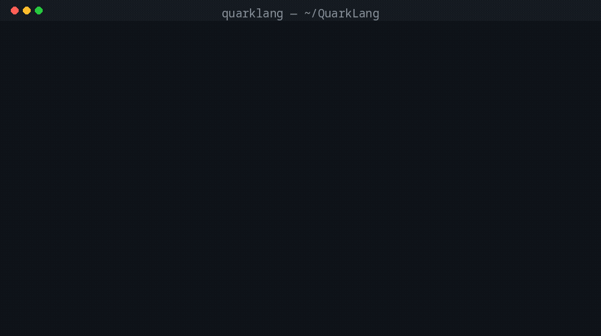

# QuarkLang (qkc)

**English** · [简体中文](README.zh-CN.md)

[](https://github.com/QuarkLangCommunity/QuarkLangQkc/actions/workflows/ci.yml)
[](https://github.com/QuarkLangCommunity/QuarkLangQkc/actions/workflows/release.yml)
[](https://github.com/QuarkLangCommunity/QuarkLangQkc/releases/latest)


**QuarkLang is a type-first compiled language with two backends for one source file** — a Go interpreter
(edit and run) and an LLVM compiler `qkc` (performance on par with C).
It targets **compute-heavy, highly concurrent, allocation-heavy CLI and service workloads**:
`fib(35)` in 21 ms (C: 22 ms), Erlang-style user-space tasks, and a block allocator with no GC pauses.
It ships with a linter, doc generator, REPL, language server and editor support — and **zero third-party Go dependencies**.

| You are… | You get… |
|---|---|
| Looking for a language that is genuinely fast once compiled | Compiled path performance = C (same LLVM backend); P99 latency on par with C |
| Writing CLIs, scripts or long-running services | Instant feedback with the interpreter; one command to compile with `qkc -run` |
| Needing concurrency without GC pauses | `taskm` user-space tasks + thread pool; block allocation, no GC pauses |
| Building editor/tooling integrations | Stable CLIs, an LSP server, a tree-sitter grammar, `-json` machine-readable diagnostics |

<p align="center"></p>

> Everything in the GIF is real output (regenerate it with `scripts/make-demo-gif.py`):
> `quark hello.qk` → `qkc -run hello.qk` → `QK_LANG=en qkcheck examples/` (a genuine warning, not a mock-up).
> The last line demonstrates the bilingual tooling: the same command prints Chinese by default.

## 🚀 Quick start

```sh
# ① Prebuilt binary (Linux x86_64; macOS / Windows have their own assets on the Releases page)
curl -fsSL https://github.com/QuarkLangCommunity/QuarkLangQkc/releases/latest/download/quark-linux-amd64 -o quark \
  && chmod +x quark && ./quark examples/hello.qk
```

```sh
# ② From source (one line; requires Go ≥ 1.26)
git clone --depth 1 https://github.com/QuarkLangCommunity/QuarkLangQkc && cd QuarkLangQkc \
  && go build -o quark . && ./quark examples/tour.qk
```

```sh
# ③ Compile and run (native LLVM; requires clang)
cd compiler && go build -o qkc . && ./qkc -run ../examples/hello.qk
```

```sh
# ④ Toolchain (all reuse the same front end): lint / docs / REPL / language server
go build -o qkcheck ./cmd/qkcheck && ./qkcheck examples/          # exits 1 on findings; -json for CI
go build -o qkdoc   ./cmd/qkdoc   && ./qkdoc -o API.md examples/tour.qk
go build -o qkrepl  ./cmd/qkrepl  && ./qkrepl -e "int x = 6;" -e "x * 7"
go build -o qklsp   ./cmd/qklsp   && ./qklsp                      # editor integration in editors/
```

> Releases ship both **versioned** assets (`quark-2.1.0-linux-amd64`) and **version-less aliases**
> (`quark-linux-amd64`) so scripts can pin a stable URL. Verify downloads against
> `MANIFEST-<version>-<platform>.txt` (sha256).

<details>
<summary>Building from source: full notes (interpreter / compiler dependencies)</summary>

### Interpreter (repository root, Go module `quarklang`)

```sh
go build -o quark .
./quark examples/hello.qk
go test ./internal/lang/     # full test suite (-race works too)
```

### Compiler (`compiler/`, LLVM backend)

```sh
cd compiler && go build -o qkc .
./qkc -run hello.qk          # LLVM IR → clang native → execute
./qkc hello.qk               # emit IR only
```

**Requirements**: Go ≥ 1.26 (zero third-party Go dependencies); an LLVM toolchain (`clang`/`lli`/`llvm-as`).
Optional `rustc`/`gcc` are only needed for the cross-language benchmark suite.

</details>

## Language / 语言

Tool messages and generated documentation are **bilingual (Chinese / English)**:

```sh
QK_LANG=en qkcheck examples/          # environment variable (explicit; nothing else is consulted)
qkcheck --lang en examples/           # per-invocation flag (also: --lang zh)
qkc --lang en hello.qk                # all CLIs accept --lang: quark/qkc/qkcheck/qkdoc/qkrepl/qklsp
```

- **The default follows your system locale**: an English machine reports English, a Chinese machine Chinese; `QK_LANG` (or `--lang`) always wins.
- Untranslated messages **fall back to Chinese rather than disappearing** — information is never dropped.
- Coverage is enforced in CI: `TestTableCoversWiredTemplates` fails if a wired Chinese message has no English entry,
  and `TestEnglishModeRendersEnglish` renders real type/parse/lint failures in English and rejects any leftover Chinese.
- New messages: add the Chinese template to your call site via `i18n.T(...)`, then register the English in
  `internal/i18n/table.go` (the test lists exactly what is missing).

## Contents

[Quick start](#-quick-start) · [Language tour](#language-tour) · [Toolchain](#toolchain) · [Highlights](#highlights) ·
[Performance](#performance-measured-reproducible) · [Cross-platform](#cross-platform-linux--macos--windows) ·
[Language features](#language-features-v2-syntax) · [Ecosystem](#ecosystem) · [Project layout](#project-layout) ·
[Contributing](#contributing) · [Spec (Chinese)](https://github.com/QuarkLangCommunity/QuarkLangQkc/blob/docs/spec.md)

## Language tour

The most honest introduction is code that runs. This is `examples/tour.qk` — it produces
**byte-identical output on both backends** (interpreter and compiler):

```qk
program main;

/* Language tour / 语言巡礼
 * Type-first syntax: struct/impl, generics, try/catch, List — runnable as-is.
 * 类型在前：struct/impl、泛型、try/catch、List —— 可直接运行。
 * Identical output on both backends / 解释器与编译器两条路径输出一致。 */

type struct { int x; int y; } Point;            // struct / 结构体

impl {
    fn new(int x, int y) Point {                // static method / 静态方法（无 self）
        Point p = .{x: x, y: y};                // struct literal / 结构体字面量（字段名: 值）
        return p;
    }
    fn sum(Point self) int {                    // instance method / 实例方法（首参 self）
        return self.x + self.y;
    }
} Point;                                         // name after the block / 实现名写在块后

fn<T> twice(T v) T { return v; }                // generics, type-erased / 泛型（类型擦除）

fn main(IOStream io) {
    Point p = Point::new(3, 4);                 // static call with :: / 静态调用 ::
    io.println("point sum =", p.sum());         // instance call with . / 实例调用 .

    List<int> l = [1, 2, 3];
    int total = 0;
    for (int v : l) { total = total + v; }
    io.println("list total =", total);

    try {
        io.println(1 / 0);
    } catch (void e) {                          // catchable error / 可捕获的错误
        // Using `e` inside catch is not supported on the compiler path yet.
        // 编译器路径暂不支持在 catch 体内读取 e；两条路径都只做"已捕获"提示。
        io.println("caught: division by zero");
    }
    io.println("twice =", twice(21));
}
```

```sh
$ quark examples/tour.qk        # or: qkc -run examples/tour.qk
point sum = 7
list total = 6
caught: division by zero
twice = 21
```

<details>
<summary>More runnable examples</summary>

```sh
quark examples/hello.qk
quark examples/fib.qk
quark examples/struct.qk
quark examples/macro.qk
quark examples/sum.qk
```

</details>

## Toolchain

| Tool | Purpose | One-liner |
|---|---|---|
| `quark` | Interpreter: edit-and-run, REPL-friendly | `./quark examples/hello.qk` |
| `qkc` | LLVM compiler / library artifacts / preprocessor | `./qkc -run hello.qk` (IR: `./qkc hello.qk`) |
| `qkcheck` | Static analysis QK101–QK115; `-json` for CI/editors | `./qkcheck examples/` |
| `qkdoc` | `/* */` + `pub` → Markdown / HTML API docs | `./qkdoc -o API.md lib.qk` |
| `qkrepl` | Interactive evaluation: multi-line blocks, persistent environment | `./qkrepl -e "int x = 6;" -e "x * 7"` |
| `qklsp` | Language server: diagnostics / definition / completion / hover / outline | `./qklsp` (VS Code extension in `editors/vscode`) |

### Static analysis: qkcheck

```sh
go build -o qkcheck ./cmd/qkcheck
./qkcheck examples/                                  # files or directories; exit 1 on findings
./qkcheck -json -L ../QuarkLangLibs-Style lib.qk     # machine-readable; -L adds import search paths
./qkcheck -params src.qk                             # also check unused parameters
```

| Code | Check | Notes |
|---|---|---|
| QK101 | Unused variable | Declared but never read (including write-only); a `_` prefix is ignored |
| QK102 | Unused parameter | Requires `-params` (interface implementations often ignore parameters) |
| QK103 | Unreachable code | Statements after `return`/`log`/`break`; after both branches return |
| QK104 | Shadowing | `for` (both forms) / `catch` variables shadowing an outer name (three places the compiler misses) |
| QK105 | Missing return | A non-void function has a path that ends without a value (the interpreter yields nil, `qkc` zero-fills — the two disagree) |
| QK106 | Interface not implemented | Near-miss: some methods implemented, the rest missing (missing names are listed) |
| QK107 | void value misuse | Calling a void function and using the result as a value (nil at runtime) |
| QK108 | Self assignment | `x = x` / `p.x = p.x` / `l[i] = l[i]` (structurally equivalent, no effect) |
| QK109 | Constant condition | `if (true/false)`, `while (false)`; `while (true)` with no `break`/`return` (likely infinite loop) |
| QK110 | Division by a constant zero | Literal `/ 0`, `% 0`; **exempt inside `try`** (deliberate error handling) |
| QK111 | Unused import | Imported but no symbol used; skipped when the library cannot be resolved |
| QK112 | Shadowing a global function | Local variable/parameter shadowing a **global function** name (calls would resolve to the local) |
| QK113 | Dead store | An assignment (or declaration initializer) overwritten before any read; **reference writes and assignments inside loops are exempt** |
| QK114 | Self comparison | `x == x` (always true) / `x != x` (always false) |
| QK115 | Function never called | Only for `program main` (has `main`, no `pub`): a function never referenced anywhere is dead code; library files are exempt |

**False positives / false negatives (hand-labelled benchmark + randomized statistics with P99)**

```sh
# ① Hand-labelled benchmark (29 cases: 15 defects + 14 clean, including deliberate "must not report" cases)
go test ./internal/lang/ -run TestLintBenchmark -v

# ② Randomized statistics: 4 ground-truth cases per round, P50/P90/P99/max across rounds (2000 by default)
go test ./internal/lang/ -run TestLintStatsP99 -v
LINT_ROUNDS=20000 LINT_SEED=7 go test ./internal/lang/ -run TestLintStatsP99 -v   # dig into the tail

# ③ Real-corpus perturbation invariance (CRLF / trailing comments / inserted header lines / trailing whitespace)
go test ./internal/lang/ -run 'TestLintCorpusPerturbation|TestLintCRLF' -v
```

A single deterministic run says nothing about the tail, so the statistical test generates programs with
**known ground truth** (diagnostic code + line) and reports per-round FP/FN quantiles:

| Metric (per round) | seed=1 | seed=7 | seed=20260918 |
|---|---|---|---|
| FP: P50 / P90 / P99 / max | 0 / 0 / 0 / 0 | 0 / 0 / 0 / 0 | 0 / 0 / 0 / 0 |
| FN: P50 / P90 / P99 / max | 0 / 0 / 0 / 0 | 0 / 0 / 0 / 0 | 0 / 0 / 0 / 0 |
| FP rate / FN rate at P99 | 0.0% / 0.0% | 0.0% / 0.0% | 0.0% / 0.0% |

**3 seeds × 2000 rounds × 4 cases = 24,000 randomized cases (12,000 injected defects)**, with P99 and max at 0.
The harness itself caught real problems: an over-broad QK115 rule (it skipped whole files containing `pub`),
plus two defects in the benchmark generator.

| Metric | Before hardening | After |
|---|---|---|
| Cases (15 defects + 14 clean) | 21 | 29 |
| TP / FP / FN | 6 / 1 / 14 | **20 / 0 / 0** |
| FP rate | 14.3% | **0.0%** |
| FN rate | 70.0% | **0.0%** |

<details>
<summary>qkdoc: API documentation generation</summary>

```sh
go build -o qkdoc ./cmd/qkdoc
./qkdoc lib.qk                       # Markdown to stdout
./qkdoc -all -o API.md style.qk      # include non-pub symbols, write to a file
./qkdoc -html -o API.html style.qk   # self-contained HTML (no external assets)
```

- Doc comments: the `//` or `/* */` block **immediately above** a declaration (godoc rule); falls back to a
  trailing comment on the same line (`int x; // x coordinate`); the file header comment becomes the file description.
- Only `pub` symbols are exported by default; files without `pub` (e.g. `program main`) export everything.
  `impl`/`space`/`library`/`#macro` are not filtered by `pub` (the language cannot prefix them with `pub`,
  and they are what library APIs consist of; macros are split out before parsing and supplied by `ParseSourceAll`).
- Measured: `style.qk` (1,567 lines) → 8 ms to generate 335 lines of Markdown (overview table + sections).

</details>

<details>
<summary>qkrepl: interactive evaluation</summary>

```sh
go build -o qkrepl ./cmd/qkrepl
./qkrepl                      # interactive: qk> prompt, auto-continues with ..> for open blocks
./qkrepl -e "int x = 6;" -e "x * 7"   # one-shot evaluation (segments share one environment)
printf 'fib(20)\n' | ./qkrepl # batch mode (stdin is not a terminal)
```

```
qk> fn fib(int n) int {      # multi-line block: '{' not closed → continuation
..>     if (n <= 1) { return n; }
..>     return fib(n - 1) + fib(n - 2);
..> }
defined fn fib(int n) int
qk> fib(20)
6765
```

- **Persistent environment**: variables/functions/types/interfaces/impls survive across inputs; redefining a function overrides it.
- Expressions print their value; `log` records and `io.println` output appear immediately; a trailing `;` is optional.
- Commands: `:help`, `:quit`, `:load <file.qk>` (register declarations from a file, then call `main(io)`).

</details>

<details>
<summary>Editor support: qklsp + VS Code + tree-sitter</summary>

```sh
go build -o qklsp ./cmd/qklsp        # language server (stdio LSP)
./qklsp -L ../QuarkLangLibs-Style    # extra import search path
```

| Capability | Notes |
|---|---|
| Diagnostics | Parse/type errors (`qkc`) + static analysis (qkcheck QK101–QK107), correctly located across imported files |
| Go to definition | Functions/structs/interfaces/spaces/fields/locals (UTF-16 column conversion, accurate in non-ASCII sources) |
| Completion | Keywords + built-in types/methods + symbols declared in the current file |
| Hover / outline | Signature + doc comment; `documentSymbol` lists all top-level symbols |

Editor artifacts: `editors/vscode` (VS Code extension: TextMate grammar, snippets, zero-dependency LSP client),
`editors/tree-sitter-quarklang` (tree-sitter grammar, usable from Neovim/Helix/Emacs).

**Measured**: the tree-sitter grammar parses **60 `.qk/.kq` files with 0 errors** (including the 1,567-line
`style.qk` and `cleg.qk`), and `tree-sitter test` passes 5/5; `editors/vscode/test/protocol.test.js` connects
to a real `qklsp` over stdio and passes 8/8 checks.

</details>

<details>
<summary>Release artifacts and versioning (how to cut your own release)</summary>

```sh
./scripts/build-release.sh 2.1.0     # 3 platforms × 2 architectures × 6 tools → dist/ (version injection + sha256 manifest)
./scripts/changelog.sh 2.1.0         # changelog since the previous tag, grouped by kind
./scripts/changelog.sh --all > CHANGELOG.md
git tag v2.1.0 && git push origin v2.1.0   # triggers the release workflow: native builds on three platforms → GitHub Release
```

- **Version injection**: the `VERSION` file is the single source of truth; builds inject it via
  `-ldflags "-X main.version=…"`, so `quark/qkc/qkcheck/qkdoc/qkrepl/qklsp --version` all report it.
- **Artifacts**: `dist/<tool>-<version>-<os>-<arch>[.exe]` plus `MANIFEST-<version>.txt` (sha256 + size).
  The local script cross-compiles with `CGO_ENABLED=0` (portable, no system dependencies), while the release
  workflow builds **natively on each platform with cgo enabled** (so `library`/dlopen FFI works).
- The release workflow also uploads version-less aliases (`quark-linux-amd64`, …) for stable URLs, and
  publishing is gated by a GitHub Environment that requires a human approval.

</details>

## Highlights

- **Compiled performance = C**: same LLVM `-O3` backend (fib35 21 ms vs C 22 ms; P99 latency on par at every quantile).
- **Erlang-style concurrency**: `spawn/merge/block/done/channel` user-space tasks on a thread pool — Erlang's model with C-level performance.
- **Zero-GC memory**: linear block allocation + an occupancy min-heap; `delete` returns blocks to the free queue (data preserved),
  `clear` actually wipes them — no GC pauses, 0.195% fragmentation, 99.96% reuse.
- **Mathematical `sum` optimization**: closed form for linear/periodic/uniform-random sums — 1e9 terms in O(1) (2 ms; a Go loop needs 223 ms).
- **Incremental compilation**: two-level IR + binary cache, 16× faster rebuilds.
- **Zero third-party dependencies**: lexer, parser, type checker, evaluator and LLVM IR emission are all hand-written.

## Performance (measured, reproducible)

| Benchmark | QuarkLang (compiled) | C | Rust | Go | Erlang |
|---|---|---|---|---|---|
| fib(30) | **3 ms** | 3 ms | 3 ms | 6 ms | 1106 ms |
| fib(35) | **21 ms** | 22 ms | **17 ms** | 36 ms | — |
| 8-way concurrency ×1e7 | **1 ms** | — | — | 6 ms | 61 s (1e5) |
| P99 (fib20×1000) | **14/27 µs** | 16/25 µs | — | — | — |
| Tide, 1e8 rounds | **1 ms** | 1 ms | 29 ms | 92 ms | — |
| `sum` over 1e9 terms (closed form) | **2 ms** | — | — | 223 ms | — |

Reproduce with `bench/Makefile` (cross-language) and `docs/benchmarks.md` (methodology and fairness statement).

<details>
<summary>Toolchain performance work (including a measured rule for when to offload work to C libraries)</summary>

```sh
scripts/bench-tools.sh 9          # real process-level timings (median of 9 runs per scenario)
go test ./internal/lang/ -run XXX -bench . -benchmem    # library-level benchmarks (interpreter)
```

| Scenario | Before | After | Change |
|---|---|---|---|
| quark fib(25) | 32.7 ms | **22.4 ms** | −31% |
| quark 1M-iteration loop | 108.6 ms | **62.5 ms** | −42% |
| qkcheck (1,567-line file) | 23.8 ms | **4.8 ms** | **−80%** |
| qkdoc (same file → Markdown) | 9.7 ms | **3.9 ms** | −60% |
| qkfmt -l (same file) | 5.3 ms | **3.7 ms** | −29% |
| qkm build (small project, includes an interpreter compile check) | 40.0 ms | **26.9 ms** | −33% |
| qkrepl batch (200 statements) | 6.7 ms | **5.3 ms** | −21% |
| qklsp diagnostics (per keystroke, 1,500 lines) | 2.20 ms | **0.27 ms** | **−88%** |
| qklsp completion | 95 µs | **5.4 µs** | −94% |
| qklsp go-to-definition | 39.6 µs | **0.33 µs** | −99% |
| quark/qkc/qkrepl startup | ~1.9 ms | ~1.9 ms | process-creation floor |

**When is it worth offloading a service to a C library? (measured here)**

| Criterion | Data | Conclusion |
|---|---|---|
| Fixed cgo call overhead | **22 ns/call** (measured locally) | Offloading "one small step" services (per-token lexing, per-key hashing, short string builtins) **always loses** |
| Whole-file lexing (75 KB) | C scan 100 µs vs Go 230 µs, but rebuilding Go tokens costs another 100 µs | Net ≈ 0, and +30% allocations → **rejected** (the experiment was reverted; only benchmarks and the conclusion remain) |
| Regex matching (600 × `findAll` over 300 words) | pure qk 1517 ms vs PCRE2 230 ms | **6.6×** → adopted (PCRE2 backend in QuarkLangLibs-Regex) |

In one sentence: **coarse-grained services that do a whole pass per call** (regex, codecs, graphics, compression)
are worth offloading; **fine-grained services interleaved with the interpreter** (lexing, evaluation, hashing) are better left in Go.

Key optimizations (all profile-driven):

1. **Copy-free lexing / macro splitting**: `SplitMacroDefs` returns the original token slice when a file has no `#`;
   `lex` preallocates token capacity; single-character tokens use a precomputed string table.
   → parse 3.29 ms / 7.47 MB → **1.02 ms / 1.39 MB** (allocations 18,179 → 10,219).
2. **No duplicate parsing**: files without imports are type-checked directly from the already-parsed AST (`Typecheck(prog)`);
   qklsp does the same.
3. **Compile-time variable slot resolution** (`slots.go`): locally provable variables become slot indices
   (parameters plus prefix top-level declarations only, and only where no `for-in`/`catch`/C-style `for` scope intervenes),
   with a runtime `paramNames[slot] == name` guard that falls back to the slow path if the inference is ever wrong.
   → 1M loop −24%, function calls −11%.
4. **`Value.deref` split into fast/slow paths**: the hot sentinel check inlines; the deref loop moved to `derefSlow`.
   → 1M loop −29%, fib −19%.
5. **Argument arena + interned reference handles**: argument slices are borrowed from the context's `argArena`
   and returned by watermark after the call (the async taskm path copies explicitly); `refIdent` handles are
   stateless and interned per (scope, name). → allocations per call 100k → **348**, calls −25%.
6. **Editor-side caches**: the symbol table and completion candidates are cached per document version;
   diagnostics reuse the AST; rendering avoids `fmt` and preallocates.

</details>

## Cross-platform (Linux / macOS / Windows)

```
.github/workflows/ci.yml
├── test (matrix: ubuntu-latest / macos-latest / windows-latest)
│     go build ./... + go test ./...   # interpreter, toolchain, editor artifacts
│     + qkcheck multi-round P99 gate (LINT_ROUNDS=2000)
│     + corpus perturbation invariance (CRLF / comments / line shifts)
└── linux-extras (the parts that need clang / bash / node)
      dual-path comparison · tree-sitter · VS Code LSP integration · release & benchmark smoke tests
```

- **The same Go tests run on all three platforms**: no shell dependencies, no hard-coded paths (`testing.TempDir`).
- **Identical line handling**: CRLF and LF produce identical token positions (`TestLintCRLF`); 36 real corpus files keep
  an identical diagnostic set under CRLF (`TestLintCorpusPerturbation`).
- **Identical paths**: `qklsp` emits spec-compliant `file://` URIs (Windows `C:/x` → `file:///C:/x`, with the leading
  slash stripped when converting back) — covered by unit tests.
- **Cross-compilation**: three platforms × two architectures via `CGO_ENABLED=0` (`scripts/build-release.sh`);
  the release workflow builds natively on each platform with cgo enabled.

## Language features (v2 syntax)

> The canonical syntax reference is [`SYNTAX.md`](SYNTAX.md) (English) — Chinese: [`SYNTAX.zh-CN.md`](SYNTAX.zh-CN.md).

<details>
<summary>Full feature list</summary>

- **Functions**: explicit return types; `return expr` ends and returns; `log expr;` records and ends.
- **try/catch**: `try { } catch (void e) { }` — errors such as division by zero are catchable.
- **void = empty interface**: any value can be assigned to it.
- **struct / impl / interface**: `type struct { int x; } Point;`,
  `impl { fn sum(Point self) int {...} } Point;`, `.{x: 3, y: 5}` literals, `self.a` field access.
- **Generics**: `fn<T, U> name(T v) T` — type-erased; call sites infer: `name(5)`.
- **Pointers / heap allocation**: `pointer T` (equivalent to `T&`), `new T[size]` (invalid sizes raise `badAlloc`),
  null dereference raises `NullPointerError`.
- **Signatures**: `f(args) @instance(prefix)` ≡ `instance.call(prefix)(.{in, out})` — memoization/wrapping.
- **taskm concurrency**: `t thread = taskm.spawn(); t.merge(fn, args); taskm.block(t.pid()); taskm.done(pid);
  c channel = taskm.channel(); c.send(v); c.recv();` — user-space tasks + thread pool (pthread carrier in the compiled path).
- **Macro system**: `#macro name (params) { body }` with named parameters; `()`/`[]`/`{}` delimiters are interchangeable;
  the body supports `#when(compile/run)` and `#error` — **interpreter and compiler share the same token-level expansion**.
- **delete/clear semantics**: `delete` returns memory to the free queue (data preserved, reusable);
  `clear` actually wipes free blocks (in-use blocks are untouched — data safety).
- **List<int>**: literals, indexing, `size()`, `get(i)`, `append(v)` (geometric growth).
- **program/library**: `program main;` / `library;`, `import`, `pub` — publishable as `.qlib` artifacts.
- **Interpreter and compiler share one syntax** (same front end, two backends).

</details>

## Ecosystem

| Project | Description | Repository |
|---|---|---|
| QuarkLangLibs-Cleg | Certified `cleg` GUI framework: `ClegNode` interface (dynamic dispatch) + `ClegWindow`/`ClegLabel`/`ClegButton`, every node driven by Style(HashTable) rendering; runtime raster kernel (fill4K 2.5 ms, zero-allocation hot path) | https://github.com/QuarkLangCommunity/QuarkLangLibs-Cleg |
| QuarkLangLibs-GL | Certified `gl` library: **OpenGL declaration set** (`library gl { ... }` binds system GL exports directly; `glc::` constant space; cross-platform dlopen/LoadLibrary + libffi) | https://github.com/QuarkLangCommunity/QuarkLangLibs-GL |
| QuarkLangLibs-Vulkan | Certified `vulkan` library: **Vulkan declaration set** (instance/device/swapchain/memory/buffer surface + `vk::` constants) | https://github.com/QuarkLangCommunity/QuarkLangLibs-Vulkan |
| QuarkLangLibs-Json | Certified `json` library: Python-style `json::dumps` / `json::loads` (objects → HashTable, arrays → List, integers → int; malformed input raises `JSONError`) | https://github.com/QuarkLangCommunity/QuarkLangLibs-Json |
| QuarkLangLibs-Regex | Certified `regex` library: pure-qk engine **or** a PCRE2-backed backend with the same API (measured 6.6× faster) | https://github.com/QuarkLangCommunity/QuarkLangLibs-Regex |
| QuarkLangLibs-Actions | Certified `actions` library (two levels): `space` system functions (`system`/`network`, `exec`/`execv`/`popen`/`get`/`post`) + `Command`/`Network` classes implementing the `Executor` interface | https://github.com/QuarkLangCommunity/QuarkLangLibs-Actions |

Usage: put the library's `.qk` file next to your source and `import "json";` / `import "actions";` / `import "gl";` etc.

## Project layout

- `main.go` + `internal/lang/` — interpreter (lexer / parser / type checker / evaluator / runtime / macros)
- `compiler/` — LLVM compiler (`qkc` + `internal/cgen` IR emitter + embedded thread runtime)
- `cmd/` — toolchain sharing the same front end: `qkcheck`, `qkdoc`, `qkrepl`, `qklsp`
- `scripts/` — release & ops: `build-release.sh` (three-platform artifacts, version injection, sha256 manifest),
  `changelog.sh`, `make-demo-gif.py`
- `editors/` — editor support: VS Code extension (`vscode/`) + tree-sitter grammar (`tree-sitter-quarklang/`)
- `bench/` — cross-language benchmark sources (C/Rust/Go/Erlang + Makefile)
- `examples/` — runnable examples (`hello.qk`, `tour.qk`, `fib.qk`, `struct.qk`, `macro.qk`, `sum.qk`)

## Branches

| Branch | Contents |
|---|---|
| `main` | Integration (interpreter + compiler + bench) |
| `interpreter` | Interpreter history |
| `examples` | Examples |
| `docs` | Design docs, independently maintained (includes `benchmarks.md`); also served as the project site |
| `design` | XMind design blueprint (read-only) |

## Contributing

PRs and issues are welcome. The three lowest-friction ways to get involved:

| Goal | How |
|---|---|
| Report a bug / request a feature | [Open an issue](https://github.com/QuarkLangCommunity/QuarkLangQkc/issues/new/choose) (the template asks for the right details) |
| First contribution | Pick a [`good first issue`](https://github.com/QuarkLangCommunity/QuarkLangQkc/labels/good%20first%20issue) (docs, examples, error messages, tests — no compiler internals needed) |
| Submit code | Read [CONTRIBUTING.md](CONTRIBUTING.md) → branch → PR (**`main` is protected: PR required, CI must be green**) |

- **Code of conduct**: [CODE_OF_CONDUCT.md](CODE_OF_CONDUCT.md) (Contributor Covenant v2.1).
- **Run the gates locally before pushing**:

  ```sh
  go test ./...                            # interpreter + toolchain
  (cd compiler && go test ./...)           # compiler
  (cd compiler && ./testdata/compare.sh)   # dual-path parity (must print "all identical")
  go test ./internal/lang/ -run 'TestLintBenchmark|TestLintStatsP99'   # lint FP/FN gates
  ```

- **Maintainer**: [@Enoch-199811](https://github.com/Enoch-199811) — mention in an issue or PR.

## Status

The v2 syntax surface is complete (interpreter and compiler agree); compiled performance is on par with C.
See `docs/benchmarks.md` (docs branch) for methodology.

## Known gaps

Written down on purpose — a young language is better judged by what it admits than by what it advertises.

- **Compiler parity is per-construct, not per-program.** The interpreter and `qkc` are held to byte-identical output
  on the checked-in corpus (`compiler/testdata/compare.sh`, enforced in CI). Constructs the compiler cannot lower yet
  produce a hard "not supported yet" diagnostic instead of a silent behavioural difference — e.g. reading the error
  value inside a `catch` body.
- **Known bug**: `return .{...};` fails with `return type is Point, got .` because the typechecker does not propagate
  an expected type into the literal yet ([issue #7](https://github.com/QuarkLangCommunity/QuarkLangQkc/issues/7)).
- **Thin standard library**: six official libraries (json, regex, cleg, gl, vulkan, actions). There is no package
  registry — `qkm` and `qkc -L` resolve dependencies locally.
- **Macro system**: token-level macros are shared by both engines, but compile-time symbol insertion (`#ast`) and
  import resolution are still in progress.
- **Windows FFI** uses a custom ABI shim limited to ≤ 4 arguments.
- **Test coverage is 65.1%** (root module); the linter's statistical gates cover its generated corpus, not all code.
- **Source comments** are mid-translation to English (README, docs, `SYNTAX.md` and tool output are already English).
- **Compiled-path runtime text is Chinese-only for now.** `QK_LANG=en` switches the interpreter's diagnostics, but the
  C runtime embedded into compiled binaries still prints the Chinese error text (e.g. `越界`), so the dual-path
  byte-equality gate is currently asserted in the default Chinese mode.

## License

[MIT](LICENSE) © 2026 Enoch-199811
